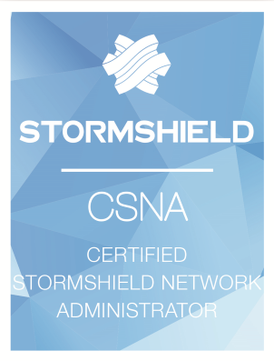

# Hello there... I'm Alexis Fala !

Infrastructure Engineer/SRE at Deezer, I'm passionate about Cloud Native technologies and music (what a luck !). With a great sense of humor, I also like to share my thoughts on topics related to psychology or science in general.

## 🚀 Skills :

#### Tools :

#### Platforms :

#### Other :

## 📜 Certifications :

